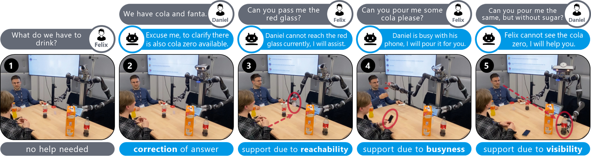
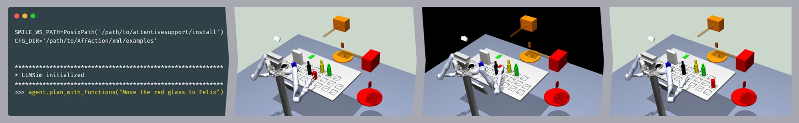

# Attentive support

A simulation-based implementation of the attentive support robot introduced in the paper
_[To Help or Not to Help: LLM-based Attentive Support for Human-Robot Group Interactions](https://arxiv.org/abs/2403.12533)_. \
See the [project website](https://hri-eu.github.io/AttentiveSupport/) for an overview.

## Setup
Prerequisites for building the simulator workspace: g++, cmake, Libxml2, Qt5, qwt, OpenSceneGraph, Bullet Physics

Ubuntu 20

libxml2-dev, qt5-default, libqwt-qt5-dev, libopenscenegraph-dev, libbullet-dev, libasio-dev, libzmq3-dev 

Ubuntu 22

libxml2-dev, qtbase5-dev, qt5-qmake, libqwt-qt5-dev, libopenscenegraph-dev, libbullet-dev, libasio-dev, libzmq3-dev 

Fedora

cmake, gcc-c++, OpenSceneGraph-devel, libxml2, qwt-qt5-devel, bullet-devel, asio-devel, cppzmq-devel, python3-devel

Clone this repo and change into it: `git clone git@github.com:HRI-EU/AttentiveSupport.git && cd AttentiveSupport` \
You can either run the setup script: `bash build.sh` or follow these steps:
1. Get the submodules: `git submodule update --init --recursive`
2. Create a `build` directory in the AttentiveSupport directory: `mkdir -p build` and change into it `cd build`
3. Install the [smile workspace](https://github.com/HRI-EU/SmileWorkspace): `cmake ../src/Smile/ -DCMAKE_INSTALL_PREFIX=../install; make -j; make install`  \
   Note that if you have the Smile workspace installed somewhere else, you have to change the relative path in `config.yaml` accordingly. For details, check [here](src/Smile/README.md)
4. Install the Python dependencies: `python -m venv .venv && source .venv/bin/activate && pip install -r requirements.txt`
5. Make sure you have an OpenAI API key set up, see the [official instructions](https://help.openai.com/en/articles/5112595-best-practices-for-api-key-safety)
6. Enjoy 🕹️

## Instructions

### Running the agent
* Activate the virtual environment: `source .venv/bin/activate`
* Run the agent in interactive mode, from the AttentiveSupport directory: `python -i src/tool_agent.py`
* Provide commands: `agent.plan_with_functions("Move the red glass to Felix")`
* Reset
  * The simulation: `SIM.reset()`
  * The agent: `agent.reset()`

### Customizing the agent
* Change the agent's character:
  * Either via the `system_prompt` variable in `gpt_config`
  * Or directly, note that this is not persistent: `agent.character = "You are a whiny but helpful robot."`
* Provide the agent with further tools:
  * Define tools as Python functions in `tools.py`
  * Make sure to use type hints and add docstrings in the Sphinx notation. This is important so that the `function_analyzer.py` can generate the function descriptions for openai automagically
  * For inspiration, check out some more examples in `src/tool_variants/extended_tools.py`
* Change generic settings such as the model used and its temperature via `gpt_config`

### Additional features
* Setting an agent as busy: `set_busy("Daniel", "iphone5")`
* Enable text to speech: `enable_tts()`

## Example
Running the simulation with `"Move the red glass to Felix"`: \

For reproducing the situated interaction scenario run the following:
- `agent.plan_with_functions("Felix -> Daniel: Hey Daniel, what do we have to drink?")` \
_Robot should do nothing because Daniel is available to answer._
- `agent.plan_with_functions("Daniel -> Felix: We have two options, cola and fanta.")` \
_Robot should correct Daniel._
- `agent.plan_with_functions("Felix -> Daniel: Daniel, please hand me the red glass.")` \
_Robot should help because the red glass is out of reach for Daniel_
- Manually set Daniel to busy with the mobile: `set_busy("Daniel", "iphone5")`
- `agent.plan_with_functions("Felix -> Daniel: Daniel, could you fill some coca cola into my glass?")` \
_Robot should help as Daniel is busy._
- `agent.plan_with_functions("Daniel -> Felix: Felix, can you give me a full glass of the same, but without sugar?")` \
_Robot should help as Felix cannot see or reach the coke zero._
- `agent.plan_with_functions("Felix -> Robot: What do you know about mixing coke and fanta?")` \
_Robot should answer._
